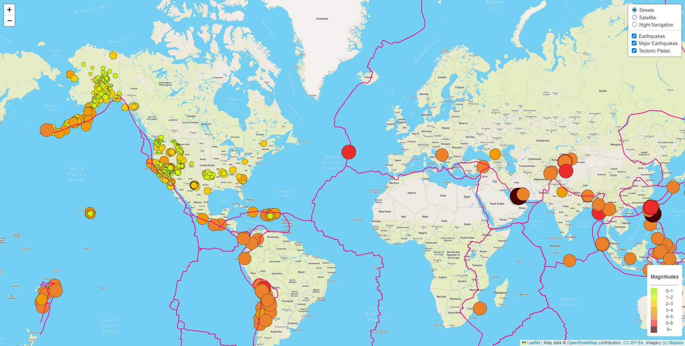

# Mapping_Earthquakes

## Overview of challenge
- The purpose of this project is to visually show the differences between the magnitudes of earthquakes all over the world for the last seven days. This project also allow us to see where are the tectonic plates located around the world. When both options(tectonic plates and earthquakes) are turned on on our layers we can verify which places are prone to earthquakes comparing them with the tectonic plates on those places. 

## A glance at the website
